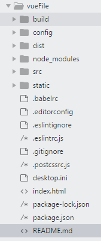
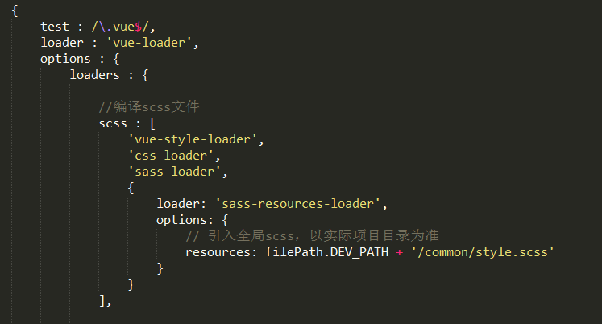

# webpack #

[webpack](https://webpack.js.org)是一个前端资源打包工具，你可以选择将css，scss，less，img全部打包成js文件。现在前端开发都是使用webpack配合框架来构建项目；初次使用webpack是配合前端框架[vue](https://cn.vuejs.org),使用vue-cli脚手架搭建的项目，先说下使用vue-cli遇到的问题。

## 使用vue-cli ##

使用vue-cli脚手架搭建环境
1. 先使用**npm install -g vue-cli**安装全局vue-cli
    >如果网速较慢的话可以使用cnpm安装
    ```
      npm install cnpm -g --registry=https://registry.npm.taobao.org
    ```

2. 使用**vue init webpack 你的项目名**基于webpack构建项目
    >使用该命令，系统会进行安装步骤，可以直接回车不用管。  
    **Use ESLint to lint your code**是官网默认推荐使用ESLint语法检测。  
    **Set up unit tests**是否安装单元测试。  
    **Setup e2e tests with Nightwatch**是否安装e2e测试

3. 使用**npm install**安装模块  

### 项目目录 ###  

  

目录|介绍  
-|- 
build|基于webpack项目构建相关代码
config|项目开发环境配置相关代码 
node_modules|项目依赖相关模块 
src|源代码目录 
static|静态资源文件目录  
dist|打包后生成的目录  

### 使用ESlint ###
[ESlint](https://eslint.org/)是一种严格模式开发，在前面安装脚手架时，官网就推荐使用**ESlint**开发，如果不习惯使用**ESlint**，可以在**build**目录下的webpack.base.config文件里注释掉这段代码：
```
    ...(config.dev.useEslint ? [createLintingRule()] : []),
```

### 全局scss ###
在实际开发中，，不管是使用scss，还是less都会碰到需要引用全局样式。如果在入口文件里面引入全局scss或less，实现不了效果，会编译不了scss和less文件，在每个组件里面引入的话太过麻烦。那就只能从webpack的配置中入手，想要引入全局scss，就需要在**build**目录下的utils文件里面对应的scss设置：
```
    scss: generateLoaders('sass').concat(
      {
        loader: 'sass-resources-loader',
        options: {
          resources: path.resolve(__dirname, 实际项目路径)
        }
      }
    ),
```
在实际项目路径写入需要引入的全局scss就可以使用了。

[^1]在使用**npm run build**打包之后，在**dist**目录下使用浏览器打开会显示空白，这是因为路径错误，只需要在**config**目录下的index文件的build的配置下更改为:
```
  assetsPublicPath: './',
```  
[^1]:这里是脚本  

## 手动搭建 ##
有时候可能觉得vue-cli脚手架搭建的项目需要安装的插件太多，太过笨重，有些插件可能用不到或者不需要，而脚手架里面的webpack配置有些太过复杂看不懂，这时候就需要手动去搭建。

### 步骤 ###
1. 创建文件夹后，使用**npm init**初始化，就会在该文件夹下生成一个**package.json**文件  

2. 在该文件夹内创建**webpack.config.js**文件，webpack所有的配置都写在里面，当然也可以选生产环境配置一个文件，开发环境配置一个，这样更加的灵活。

3. 然后就是**npm install**安装所需的插件，可以在一边写配置，一边安装所需插件**npm install 插件名 --save-dev**，也可以写一边写配置，一边把需要安装的插件名写入**package.json**文件下面的devDependencies配置里，配置写完后使用**npm install**一键安装。  
    >__注意：__ 如果是单独一个一个的安装，需统一使用npm或cnpm安装，以免出现不必要的报错。

### 全局scss ###
引入全局的scss文件在手动搭建的webpack配置里，需要在vue-loader后面配置：



